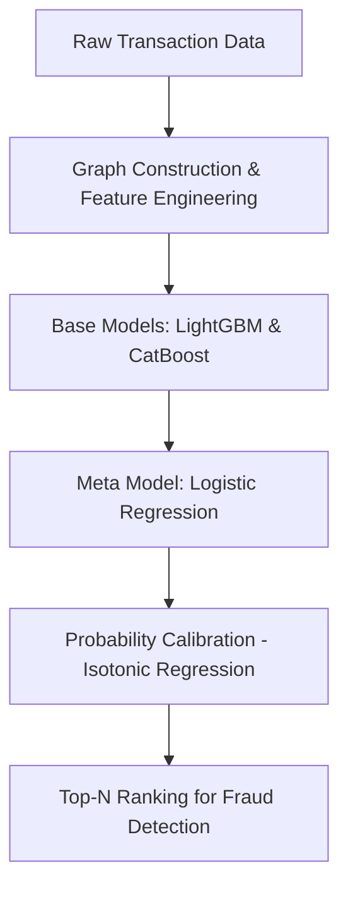

# Anti-Money Laundering (AML) Detection — Hackathon Project

## Overview

This repository contains the solution my team and I developed during the $8^{th}$ edition of [Stat Under the Stars](https://sis2025.sis-statistica.it/sus-2025/) hackathon, which focused on **Anti-Money Laundering (AML)** — the process of detecting and preventing illicit financial activities where criminals disguise illegally obtained funds as legitimate income.

Money laundering is a **major challenge in modern banking and finance**, as institutions must comply with strict regulations and develop robust detection systems. The dataset provided simulates **transactional banking data** containing thousands of legitimate transactions and a small fraction of suspicious ones potentially linked to money laundering.

The main task:

> **Build a binary classification model to identify laundering transactions among legitimate ones.**

---

## Dataset

The dataset contains **anonymized banking transactions** aimed at detecting suspicious behavior possibly linked to money laundering.

**Files:**

* **`sus8_train.csv`** — 55,307 labeled transactions (training set)
* **`sus8_test.csv`** — 23,743 unlabeled transactions (test set)
* **`submission.txt`** — Team LVRS Submission 

**Key Features:**

* **From Account / To Account** — Anonymized sender/receiver IDs
* **Payment Type** — Transaction type (e.g., `"Credit"`, `"Cheque"`)
* **Amount Paid** — Transaction amount
* **Type Account From / To** — Account types (`A`–`F`)
* **Avg Stock From / To** — Avg. account balance in last 30 days
* **Is Laundering** — Target label (1 = laundering, 0 = legitimate) — *train set only*

The dataset is highly **imbalanced** and may contain noise, missing values, and complex interdependencies, reflecting real-world AML detection challenges.

---

## Problem Statement

We are given a dataset containing banking transaction records.
Among a **heavily imbalanced dataset**, only a **small proportion** of transactions are related to money laundering.

**Objective:** Develop a machine learning model that can **accurately distinguish** between normal and laundering transactions while considering the severe class imbalance.

---

##  Evaluation Metrics

To assess model performance fairly and effectively, the hackathon defined a **custom evaluation metric** combining three components:

### 1. **AUC (Area Under the ROC Curve)**

* Measures the model’s ability to distinguish between fraudulent and non-fraudulent transactions.

### 2. **Balanced Accuracy**

Ensures good performance on both classes, even with imbalance:

$$
\text{Balanced Accuracy} = \frac{TPR + TNR}{2}
$$

Where:

* **TPR (True Positive Rate)** = TP / (TP + FN)
* **TNR (True Negative Rate)** = TN / (TN + FP)
* **TP**: Fraud correctly classified
* **FN**: Fraud missed
* **TN**: Legitimate correctly classified
* **FP**: Legitimate misclassified as fraud

### 3. **Fraud Capture Rate (Top-N Predictions)**

Focuses on **catching the most suspicious cases**:

$$
\text{Fraud Capture Rate} = \frac{\sum_{i \in T_{485}} y_i}{\sum_{i \in T} y_i}
$$

Where:

* **N = 485**: Number of transactions selected for manual review
* $T_{485}$: Indices of the top-485 highest fraud probability predictions
* $y_i$: True label of transaction *i* (1 = fraud, 0 = legitimate)
* $T$: Total set of fraudulent transactions

### **Final Score**

The overall score is the **arithmetic mean** of:

* **AUC**
* **Balanced Accuracy**
* **Fraud Capture Rate (Top 485)**

$$
\text{Final Score } =\frac{AUC + BA + FCR}{3}
$$

---

## Approach
We designed a stacked ensemble pipeline to detect rare fraudulent transactions by combining graph-based features with powerful gradient boosting methods.

Raw transaction data was transformed into a **transaction graph**, from which we extracted structural features (e.g., node degree, connectivity patterns) alongside tabular attributes. Two high-performance gradient boosting models, **LightGBM** and **CatBoost**, served as base learners. Their outputs were **stacked** and fed into a **Logistic Regression** meta-model, which provided an optimal linear blend of predictions.

To improve reliability, we applied **isotonic regression** for probability calibration, ensuring that predicted fraud probabilities matched observed risk levels. Final outputs were ranked by fraud probability, optimized for the competition’s key metric — Fraud Capture Rate in the Top-485 transactions. Hyperparameters were tuned with **Optuna** for efficient search and improved generalization.

This end-to-end pipeline —
**Graph features** → **LightGBM** + **CatBoost** → **Logistic Regression** (meta) → **Calibration** → **Ranked Predictions** — consistently outperformed individual models and provided a robust, high-performance fraud detection strategy.

---

## Results

**Final Score** : 0.76594

---

##  Hackathon Insights

* **Imbalanced datasets** require careful metric choice; accuracy alone is misleading.
* **Top-N prioritization** aligns well with real-world AML processes where only a subset of transactions can be manually reviewed.
* Feature engineering from **transactional patterns** is often more valuable than raw model complexity.

## Team Members 

* **L**eonardo Rocci   
* **V**aleria Avino  
* **R**iccardo Soleo  

*( before the hackathon )*

*( ... at 4 a.m., during the hackathon )*

---

## License

This project is licensed under the MIT License — see the [LICENSE](LICENSE) file for details.

---
